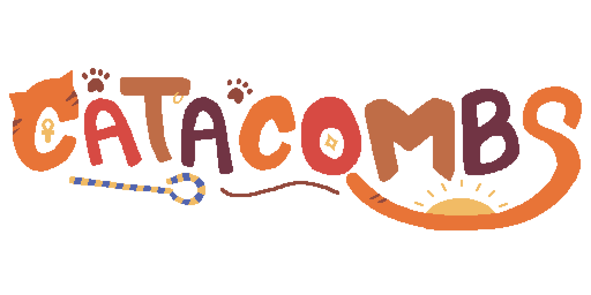

# Lawrence Daniels's portfolio
### Below are a few of my favorite programming projects
### Unfortunately, I can't release most of the source code as many of these projects are built with proprietary technology (most belonging to Cornell University) 
### If you want any further information, please email me at lawrencedanielsjr@gmail.com

# Games
## 
## more coming soon!

# Computer Graphics
## Cell/Toon shaders

This was for a project for Cornell's Introduction to Computer Graphics course. This was part of a group project, though much of my responsibility for the project was in writing shaders to stylize the game assets. I ended up going with a cell/toon shading approach which outlines the characters and quantizes their colors to emulate a cartoonish aesthetic. These are somewhat difficult to notice in the final product, so here are isolated screenshots below using the Stanford Asian Dragon model. This project was coded in TypeScript, though the shaders were coded in GLSL.  
{:class="img-responsive"}
{:class="img-responsive"}

You *can* interact with the final project on [this page](https://lwdaniels.github.io/4620-final-project/), but I would instead suggest that you view [this page](https://lwdaniels.github.io/cell-shading/) as to focus on my contributions to the project. I advise fiddling with the sliders on the right; if you want to replicate the look above, start with parameters similar to these:  
{:class="img-responsive" width:"50%"}

If you like shaders and want to look at the ones I wrote for this, you can look [here](https://github.com/LWDaniels/LWDaniels.github.io/tree/main/cell-shading/shaders/cellshader). Please note that this was my first experience writing shaders and there is a lot I would change if I were to revisit this project (both with my actual code and the process of toon/cell shading as a whole).

## Raytracing and Refraction

This was another project for Cornell's Introduction to Computer Graphics course. This was a raytracing project and nearly the entire raytracing and rendering functionality was built in our code using Python and Numpy. I worked with a partner on this project and while we both put together the basic raytracing functionality, I coded all of the refraction-related aspects of the project (i.e., the glass-like quality of the spheres). This project was an honorable mention for one of the top projects produced by that class and has some very interesting technical aspects.

{:class="img-responsive"}

